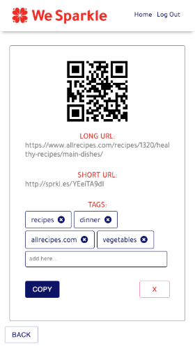

# Client Project - We Sparkle

_Duration: 2 Week Sprint_

Description

## Prerequisites

Before you get started, make sure you have the following software installed on your computer:

- [Node.js](https://nodejs.org/en/)
- [PostrgeSQL](https://www.postgresql.org/)
- [Nodemon](https://nodemon.io/)

## Screen Shots

### User View

## Installation

1. Create a database named `wesparkle_client`.
2. The queries in the `database.sql` file are set up to create all the necessary tables and populate the needed data to allow the application to run correctly. The project is built on [Postgres](https://www.postgresql.org/download/), so you will need to make sure to have that installed. We recommend using Postico to run those queries as that was used to create the queries. 
3. Open up your editor of choice and run an `npm install`
- Make sure you also have other dependencies installed (found in json file)
4. Run `npm run server` in your first terminal
5. Run `npm run client` in your second terminal
6. The `npm run client` command will open up a new browser tab for you!

## Usage

1. Enter a link that is too long and would like to shorten into the first text field and 
2. Click generate
3. A much shorter link (beginning with http://sprkl.es/) will appear in the second text field
   A QR code also appears at the bottom of the screen
4. When the short link is clicked, it will direct to the same location as the long link
   When the QR code is scanned it will direct to the same location as well
5. 

## Built With

Technologies here!

## Acknowledgement
Thanks to our clients at WeSparkle, Michelle and Rachel. Thanks also to [Prime Digital Academy](www.primeacademy.io) who equipped and helped us to make this application a reality, as well as the members of our cohort, Paxos, for their support.

## Support
If you have suggestions or issues, please email us at [email@gmail.com](www.google.com)